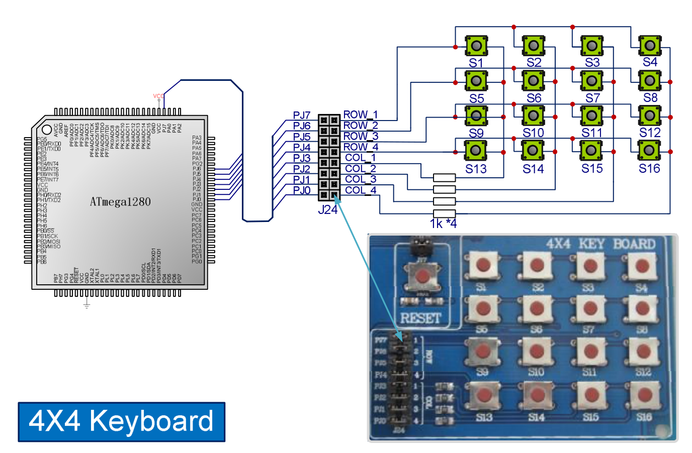

## Before you start:

Make sure the switches are set in the correct state as shown in the diagram, otherwise the specified peripheral won't work correctly or at all.

It is assumed that the reader has some knowledge of port pin configurations.

## LEDs

LEDs are straight forward, they'll light up whenever current is driven through the connected pins.
Since LEDs are connected to Port H, the data direction register (DDRH) will be set to high to set it in output mode.
To turn the LED's on and off, the port's data register (PORTH) can be driven high or low.

## 4x4 keyboard

I don't think it's necessary to write another guide on the logic behind the 4x4 keyboard as there are countless guides online.
What I can offer is a visual representation of how it works, in the assets folder you'll find a falstad circuit which you can run on https://www.falstad.com/circuit/ (File >> Open file)

